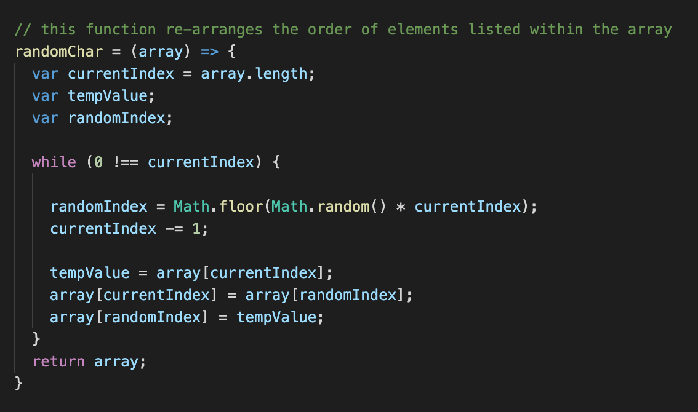

# clicky-game

The clicky game, Super Smash Bros Edition! A fun little memory game with but a few (currently 24) of the 70+ featured characters from Nintendo's #1 top selling franchise. The game is quite simple: The player must select each picture once (and only once) and wins when all 24 have been chosen without repeats. Should the player select the same character twice within the same game, the round starts over and returns their score to 0.
​
## Getting Started
​
To play my game, simply visit the live link (https://casey-moldavon.github.io/clicky-game/) or visit my repository to download and play on a localhost server.

Instructions:
The rules are simple. Click on each image only once to increase your score. If you select the same character twice, the game ends and starts over.

## Development

I began working on this project starting with the basics. Now, normally i'd begin with a theme but i'm quite indicisive and picky about these things and i didn't want to pick a theme i've done with previous projects. So i began working on the project, building it up in hopes that a theme would eventually come to me.

I started with the file and folder structure of the app. These were shifted quite a bit throughout, adding, deleting and so on, but for the most part, it followed a similar look to what i have now with an src file containing components (within a folder), a json file which would house the characters (once a theme was chosen) and the files generated by React. Initially i had to sort through each of them to delete a few text files and logos that were completely un-needed.

After the file structure was in place, i started working on functionality and basic layout. The overall functionality with regards to element display was the probably the easiest part. Full disclosure, this was actually my first project in React so i encountered quite a few challenges. Once i could display elements onto the page, i started looking for a theme. This took a bit of time but as i was positive someone would choose the more common nerdy subjects i enjoy, such as Star Wars. Then i thought "okay maybe super heros? Marvel perhapse?" but then i noticed "oh yeah, those are super popular now and i would like to maybe apply that on a future project with a smaller roster requirement. So then video games came to mind which instantly lead to one of my favorite game franchises (Super Smash Bros).

They have PLENTY of characters, well over 70 which makes for a very rich reasource with regards to content. Didn't take long to find some images i could use, especially those with transparent backgrounds (something i typically look for now days for styling). Eventually used this in coordination with the Smash Bros logo to place characters in front of the actual icons from the game.

Then i began psudo coding out the thought process of the score keeping, randomized displaying and correct/incorrect functioanlity of the app. This was extremely challenging for me and took quite a bit of time and research to figure out.

For the image display randomization, i tried multiple methods but found that a simple function for randomizing the order of an array was all i needed since the characters were stored as objects within an array inside the json file. from there i just googled a simple randomize method to re-arrange the array. This function would be called after the user selects a character. This was my next challenge and probably the hardest part.

in this image above, you'll see the function i used/altered to randomly rearrange the json array of character objects.

I needed to create a function that would not only detect that the user has clicked on an image and then identify what that image was but i would also need to include code to identify if the image was "correct" or "incorrect" based on if it had been previously chosen or not. This took a bit of time. At one point i even added count variables to each object within the json array with the plan to just add to that somehow and track with conditional statements to see if it was greater than 1. Without going too much into detail of my testing/writing process, i eventually managed to figure out each step of funcrtionality needed. This was quite ONLY possible because i literally took things one step at a time.

this image above displays the majority of the game's functionality and complexity

Overall, id summarize this experience as overwhelming and, at times, frustrating but highly educational, especially through practice. React is quite different from anything i've worked with before but yet still familiar enough to get once you look past all the indimidating files...there are so many! And most of them have only a few lines of code. CRAZY!!! This project has veeerrrryyyyy few by comparison to most i've seen in the last week. Anywho, i spent the rest of my time after completing the functionality just working on the overall appearance. Also tried to make it mobile friendly but i've been conflicting a bit with Materialize which leads me to believe ill have to make a change for future projects in react. For now, im off to start my next project and stufy up more on React. Enjoy the game!

## Built With
​
* [HTML](https://developer.mozilla.org/en-US/docs/Web/HTML)
* [CSS](https://developer.mozilla.org/en-US/docs/Web/CSS)
* [Materialize](https://materializecss.com/)
* [Javascript](https://developer.mozilla.org/en-US/docs/Web/JavaScript)
* [React](https://reactjs.org/)
​

## Deployed Link
​
* [See Live Site](https://casey-moldavon.github.io/clicky-game/)
​
​
## Authors
​
* **Casey Moldavon** 
​
- [Link to Portfolio Site](https://casey-moldavon.github.io/updated-portfolio-2/)
- [Link to Github](https://github.com/casey-moldavon/clicky-game)
- [Link to LinkedIn](https://www.linkedin.com/in/casey-moldavon-442a1761/)
​
